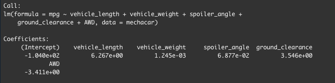
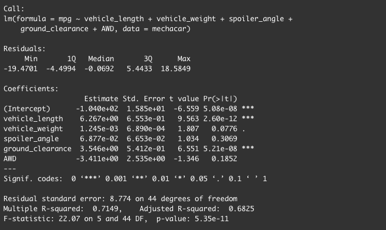

# MechaCar_Statistical_Analysis

## Purpose
In this analysis the data is being explored for the optimal prototypes for the new MechaCar. However, there are production troubles that are blocking the manufacturing team’s progress and thus production data is being reviewed to assist the manufacturing team. Using R, different statistical tests are run to analyze the performance of various variables. A statistical study is also performed in order to improve vehicle performance.

## Linear Regression to Predict MPG
MechaCar prototypes are created with many different design specifications in order to identify ideal vehicle performance specifications. a linear regression model is produced in order to the mpg of the MechaCar based on different variables. Below, a linear regression is completed with 6 variables passed in: 

The summary function is then used on the previous function in order to identify the p-value and r^2 for the linear regression model. 

- In the second image, the Pr(>|t|) value for each variable is shown. A very small value has a statistically singificant relationship with the response variable in the model and a larger value does not have a significant relationship. With this being said, the Intercept, vehicle_length, and ground_clearance can be said to provide a non-random amout of variance to the mpg values in the dataset due to their size.  
- Is the slope of the linear model considered to be zero? Why or why not?

The null hypothesis for a linear regression is that the slope of the model is zero. The alternate hypothesis is that the slope is not zero. Given that our significant level is at 0.5, our p-value lies much lower than this and we reject the null hypothesis. There fore the slope of the linear model is not considered to be zero. 
- Does this linear model predict mpg of MechaCar prototypes effectively? Why or why not? (DO NOT INCLUDE THIS "Multiple R-squared increases as more variables are passed through the regression. However, adjusted R-squared controls against this increase, and adds penalties for the number of predictors in the model, thus making it a more accurate predictor of how effective the linear model is.")

