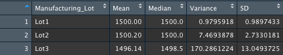

# MechaCar_Statistical_Analysis

## Purpose
In this analysis the data is being explored for the optimal prototypes for the new MechaCar. However, there are production troubles that are blocking the manufacturing team’s progress and thus production data is being reviewed to assist the manufacturing team. Using R, different statistical tests are run to analyze the performance of various variables. A statistical study is also performed in order to improve vehicle performance.

## Linear Regression to Predict MPG
MechaCar prototypes are created with many different design specifications in order to identify ideal vehicle performance specifications. a linear regression model is produced in order to the mpg of the MechaCar based on different variables. Below, a linear regression is completed with 6 variables passed in: 

The summary function is then used on the previous function in order to identify the p-value and r^2 for the linear regression model. 

- In the second image, the Pr(>|t|) value for each variable is shown. A very small value has a statistically singificant relationship with the response variable in the model and a larger value does not have a significant relationship. With this being said, the Intercept, vehicle_length, and ground_clearance can be said to provide a non-random amout of variance to the mpg values in the dataset due to their size.  
- The null hypothesis for a linear regression is that the slope of the model is zero. The alternate hypothesis is that the slope is not zero. Given our significance level of 0.5, our p-value lies much lower than this and we reject the null hypothesis. Therefore the slope of the linear model is not considered to be zero. 
- Using the r squared value, future observations can be predicted as this value represents how well the model approximates real world points. There are two values listed, the multiple r squared and the adjusted r squared values. Multiple r squared values increase as more variables are added since more variables explains some variance. The adjusted r squared values acts a control for the increase of the multiple r suqared value and lowers it for the number of factors included in our regression model. With this being said we will use the adjusted r squared value of 0.6825. This value tells us that 68.25% of variability of the dependent variable is explained by our model and thus does predict the mpg of prototypes effectively. 

## Summary Statistics on Suspension Coils
A summary statistic table is made to explore the results from multiple production lots of the MechaCar. The weights of suspension coils in this dataset are being used to determine consistency among different production lots. The table below displays summary statistics for the suspension coils:

Below the summary statistics are performed again but the suspension coil PSI information is first grouped by lot number. 

-The design specifications for the MechaCar state that the suspension coil variance must not exceed 100 pounds per square inch (PSI). When looking at the first total summary table, the PSI variance is at 62.3 thus meeting that 100 pound limit. But, when the data is broken up individually, Lots 1 and 2 meet the variance requirement much below 100, while the third lot exceeds this limit at 170 pounds. This shows that there must be manufacturing issues with suspension coils at lot 3. This very high value for lot 3, combined with low PSI values for lots 1 and 2 explain the seemingly normal value in our total summary table as the numbers averaged out reasonably, but by splitting them apart we can see that the third lot does not meet requirements. 
