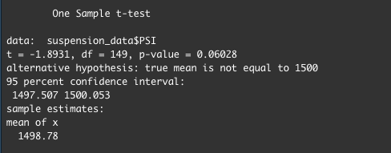
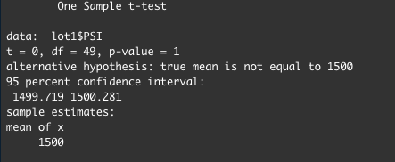
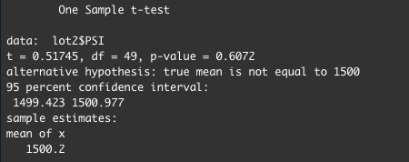
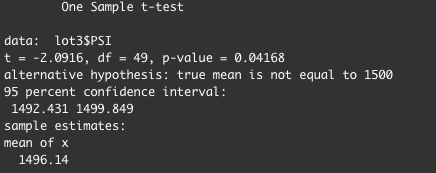

# MechaCar Statistical Analysis

[Link to RScript](https://github.com/c-geisel/MechaCar_Statistical_Analysis/blob/main/MechaCarChallenge.RScript.R)

## Purpose
In this analysis the data is explored for the optimal prototypes for the new MechaCar. However, there are production troubles that are blocking the manufacturing team’s progress and thus production data is being reviewed to assist the manufacturing team. Using R, different statistical tests are run to analyze the performance of various variables. A statistical study is also performed to improve vehicle performance.

## Linear Regression to Predict MPG
MechaCar prototypes are created with many different design specifications to identify ideal vehicle performance specifications. a linear regression model is produced to compare the mpg of the MechaCar based on different variables. Below, a linear regression is completed with 6 variables passed in: 

The summary function is then used on the previous function to identify the p-value and r squared value for the linear regression model. 

- In the second image, the Pr(>|t|) value for each variable is shown. A very small value has a statistically significant relationship with the response variable in the model and a larger value does not have a significant relationship. With this being said, the Intercept, vehicle_length, and ground_clearance can be said to provide a non-random amount of variance to the mpg values in the dataset due to their size.  
- The null hypothesis for a linear regression is that the slope of the model is zero. The alternate hypothesis is that the slope is not zero. Given our significance level of 0.5, our p-value lies much lower than this and we reject the null hypothesis. Therefore, the slope of the linear model is not considered to be zero. 
- Using the r squared value, future observations can be predicted as this value represents how well the model approximates real world points. There are two values listed, the multiple r squared, and the adjusted r squared values. Multiple r squared values increase as more variables are added. The adjusted r squared values acts a control for the increase of the multiple r squared value and lowers it for the number of factors included in our regression model. With this being said we will use the adjusted r squared value of 0.6825. This value tells us that 68.25% of variability of the dependent variable is explained by our model and thus does predict the mpg of prototypes effectively. 

## Summary Statistics on Suspension Coils
A summary statistic table is made to explore the results from multiple production lots of the MechaCar. The weights of suspension coils in this dataset are being used to determine consistency among different production lots. The table below displays summary statistics for the suspension coils:

Below the summary statistics are performed again but the suspension coil PSI information is first grouped by lot number. 

-The design specifications for the MechaCar state that the suspension coil variance must not exceed 100 pounds per square inch (PSI). When looking at the first total summary table, the PSI variance is at 62.3 thus meeting that 100-pound limit. But, when the data is broken up individually, Lots 1 and 2 meet the variance requirement much below 100, while the third lot exceeds this limit at 170 pounds. This shows that there must be manufacturing issues with suspension coils at lot 3. This very high value for lot 3, combined with low PSI values for lots 1 and 2 explain the seemingly normal value in our total summary table, but by splitting them apart we can see that the third lot does not meet requirements. 

## T-Tests on Suspension Coils
In this third analysis, t-Tests are used to determine if all manufacturing lots and each lot individually are statistically different from the population mean of 1,500 pounds per square inch. First, we use a t-test to test the PSI across all lots against the population mean. The results are as follows: 

Being that we are using a significance level of 0.05, the p value is statistically significant and therefore we do not have sufficient evidence to reject the null hypothesis. This means that there is no statistical difference between the observed and population mean. 

Next, subsets of the suspension coil data are made to get data grouped by manufacturing lot numbers and t-tests are performed on the PSI of each lot. The results for each t-test are shown in order:

  

Looking at the resulting p-values for each lot, Lots 1 and 2 have significant p-values and thus there is not sufficient evidence to reject the null hypothesis meaning that there is no statistical difference between the observed and population means. Lot 3 has a p-value of 0.04 and with a significance level of 0.05, this value is not significant, and we reject the null hypothesis to say there is a statistical difference between the observed and population mean. As seen upon observing the PSI variance in the analysis above, Lot 3 raises manufacturing concerns regarding suspension coils and a further inspection on this production line may beneficial for future prototypes. 

## Study Design: MechaCar vs Competition
To persuade customers that the MechaCar is worth their purchase we must find a way to display how it outranks the competition. The consumer wants a car that is going to hold up over time and that it is worth their money. Therefore a new statistical study is completed.
- To show customers that the MechaCar will stand the test of time compared to the competition, the means of car maintenance cost of various cars (including the MechaCar) based on miles driven will be compared. 
- The Null Hypothesis for this study is that the means of all groups are equal, which the alternate hypothesis is that the at least one of the means are different from other groups. 
- In order to complete this study, a one-way ANOVA test will be used as this test the means of a single dependent variable across a single independent variable with multiple groups. 
- To run this statistical test, data is needed from the MechaCar and various other cars in competition with us that displays data on maintenance cost on the car depending on car mileage.
